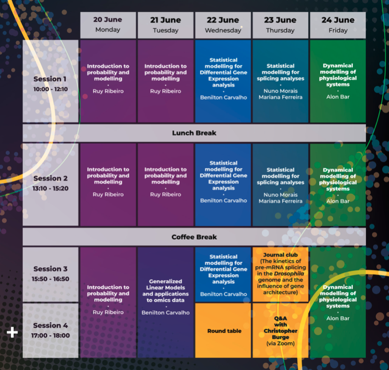

[To-do list for participants](#id-preinstallation) - [Schedule](#id-schedule) - [Social Events](#id-socialevents) -
  [Venue](#id-venue) - [Accommodation](#id-accommodation) - [Materials](#id-materials) - [Support or Contact](#id-contacts)

## To-do list for participants

We want to make sure that we can use all of the time available during the summer school for learning - and not for solving technical problems! This is why it is really important that you make sure that all the necessary software has been installed on your computer BEFORE the summer school starts. You should not leave this to the last minute so that there is time to solve any installation issues. If you have any problems or questions, don't hesitate to send a message to the course WhatsApp group!

We also ask you to carefully read the journal club paper (Pai et al. 2017) before the summer school starts. On Thursday, you will get to delve deeper into the modelling aspects of the paper - first with your team-mates and then with Chris Burge himself. But you will not have time to work through the entire paper from scratch so it is important you prepare beforehand.

<b>TO DO:</b>

1) Carefully read this paper for the journal club: https://doi.org/10.7554/eLife.32537 
2) Install the psichomics R package: https://bioconductor.org/packages/release/bioc/html/psichomics.html 

## Schedule

## Social Events

## Venue

<iframe src="https://www.google.com/maps/embed?pb=!1m18!1m12!1m3!1d31285.801742123218!2d-9.166283526806124!3d38.76084404648707!2m3!1f0!2f0!3f0!3m2!1i1024!2i768!4f13.1!3m3!1m2!1s0xd19331bc2f28e2b%3A0xbdcfa9c87a4c0bc4!2sInstituto%20de%20Medicina%20Molecular%20(IMM)!5e0!3m2!1sen!2suk!4v1653313338501!5m2!1sen!2suk" width="600" height="450" style="border:0;" allowfullscreen="" loading="lazy" referrerpolicy="no-referrer-when-downgrade"></iframe>

## Accommodation

## Materials

## Support or Contact

