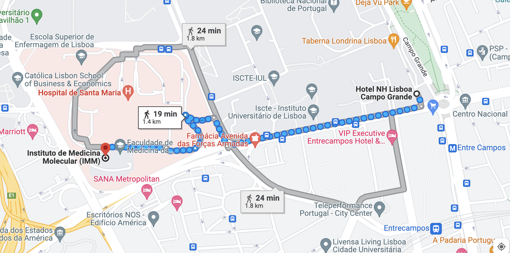

[To-do list for participants](#id-preinstallation) - [Materials](#id-materials) - [Schedule](#id-schedule) - [COVID-19 and visa requirements](#id-covid) -
  [Venue](#id-venue) - [Accommodation](#id-accommodation) - [Organisers and contact](#id-organisers)

## To-do list for participants

We want to make sure that we can use all of the time available during the summer school for learning - and not for solving technical problems! This is why it is really important that you make sure that all the necessary software has been installed on your computer BEFORE the summer school starts. You should not leave this to the last minute so that there is time to solve any installation issues. If you have any problems or questions, don't hesitate to send a message to the course WhatsApp group!

We also ask you to carefully read the journal club paper (Pai et al. 2017) before the summer school starts. On Thursday, you will get to delve deeper into the modelling aspects of the paper - first with your team-mates and then with Chris Burge himself. But you will not have time to work through the entire paper from scratch so it is important you prepare beforehand.

<b>TO DO:</b>

1) Carefully read <a href="https://doi.org/10.7554/eLife.32537">this paper</a> for the journal club. 
2) Install the <a href="https://bioconductor.org/packages/release/bioc/html/psichomics.html">psichomics R package</a>. 

 

## Materials

TBA: GitHub links.

 

## Schedule

*NB! All teaching blocks have a 10-minute break once per hour. Refreshments will be available.*

<b>Sunday the 19th of June</b>

time and place TBA: Photographic scavenger hunt

<b>Monday the 20th of June</b>

9.00: An organiser will meet you in the hotel lobby to show you the way to the institute.

9.30-10.00: Opening remarks. (*Rosina Savisaar and Maria Carmo-Fonseca*)

10.00-12.10: <a href="Ribeiro-course-plan3.pdf">Introduction to modelling (I)</a>. (*Ruy Ribeiro*)

12.10-13.10: LUNCH

13.10-14:10: <a href="Ribeiro-course-plan3.pdf">Introduction to modelling (II)</a>. (*Ruy Ribeiro*)

14.20-15.20: <a href="Ribeiro-course-plan3.pdf">Introduction to probabilities (I)</a>. (*Ruy Ribeiro*)

15.20-15.50: COFFEE BREAK

15.50-18.00: <a href="Ribeiro-course-plan3.pdf">Introduction to probabilities (II)</a>. (*Ruy Ribeiro*)

<b>Tuesday the 21st of June</b>

10.00-12.10: <a href="Ribeiro-course-plan3.pdf">Regression (I)</a>. (*Ruy Ribeiro*)

12.10-13.10: LUNCH

13.10-15.20: <a href="Ribeiro-course-plan3.pdf">Regression (II)</a>. (*Ruy Ribeiro*)

15.20-15.50: COFFEE BREAK

15.50-18.00: TBA. (*Benilton Carvalho*)

<b>Wednesday the 22nd of June</b>

TBA

12.10-13.10: LUNCH

TBA

15.20-15.50: COFFEE BREAK

TBA

17.00-18.00: Round table. (*Ruy Ribeiro, Benilton Carvalho, Mariana Ferreira, Nuno Morais, Alon Bar*)

20.00-21.30: Ruy Ribeiro speaker dinner (*attendees: Aleix Arnau Soler, Erez Greenstein, Robert Bücking, Micon Garvilles, Ana Pereira de Brito Líbano Monteiro*).

20.00-21.30: Alon Bar speaker dinner (*attendees: Harithaa Anandakumar, Isaac Wong, Pedro Barbosa, Noy Ozer*).

<b>Thursday the 23rd of June</b>

10.00-12.10: <a href="Statistical_modelling_for_splicing_analyses.pdf">Quantification of alternative sequence inclusion levels from RNA sequencing data</a>. (*Mariana Ferreira & Nuno Morais*)

12.10-13.10: LUNCH

13.10-15.20: <a href="Statistical_modelling_for_splicing_analyses.pdf">Differential splicing analyses</a>. (*Mariana Ferreira & Nuno Morais*)

15.20-15.50: COFFEE BREAK

15.50-16.50: Preparation for the journal club. (*Rui Luís and Rosina Savisaar*)

17.00-18.00: Journal club. (*Christopher Burge*)

20.00-21.30: Benilton Carvalho speaker dinner (*attendees: Ava Chan, TBA, Marko Dunjic, Rui Pedro Oliveira do Amaral Vieira*).

20.00-21.30: Mariana Ferreira + Nuno Morais speaker dinner (*attendees: Harithaa Anandakumar, Isaac Wong, Pedro Barbosa, Noy Ozer*).

<b>Friday the 24th of June</b>

10.00-12.10: Block 1. (*Alon Bar*)

12.10-13.10: LUNCH

13.10-15.20: Block 2. (*Alon Bar*)

15.20-15.50: COFFEE BREAK

15.50-18.00: Block 3. (*Alon Bar*)

20.00-22.00: Farewell party.

 

## COVID-19 and visa requirements

We emphasize that the participants are themselves responsible for making sure that they fulfill all visa or COVID-19 related requirements for entering Portugal. If you need an invitation letter, please let us know ASAP. COVID-19 related requirements may change rapidly. You can find the most recent information on <a href="https://www.visitportugal.com/en/content/covid-19-measures-implemented-portugal">this page</a>.

 

## Venue

The summer school will take place in the self-study hall (*sala de autoaprendizagem*) of the ground floor of the Egas Moniz building, which houses the Institute of Molecular Medicine. For those staying at the hotel, a volunteer will come to meet you in the lobby at 9am on the first day of the summer school to make sure you make it to the right place at the right time. The hotel is located walking distance (20-25 minutes) from the iMM.

<iframe src="https://www.google.com/maps/embed?pb=!1m18!1m12!1m3!1d31285.801742123218!2d-9.166283526806124!3d38.76084404648707!2m3!1f0!2f0!3f0!3m2!1i1024!2i768!4f13.1!3m3!1m2!1s0xd19331bc2f28e2b%3A0xbdcfa9c87a4c0bc4!2sInstituto%20de%20Medicina%20Molecular%20(IMM)!5e0!3m2!1sen!2suk!4v1653313338501!5m2!1sen!2suk" width="600" height="450" style="border:0;" allowfullscreen="" loading="lazy" referrerpolicy="no-referrer-when-downgrade"></iframe>

 

## Accommodation

You will be housed at the <a href="https://www.nh-hotels.com/hotel/nh-lisboa-campo-grande">NH Lisboa Campo Grande</a>. To get there from the airport, you're probably best off either getting the metro or an Uber. A regular taxi will cost an arm and a leg and is thus not recommended. If you decide to get the metro, you need to first take the red line from the airport to Saldanha, and then the yellow line from Saldanha to Entre Campos. From the Entre Campos metro station, it is a 5-minute walk to the hotel.

 

## Organisers and contact

<b>Chief organizer</b> 
Rosina Savisaar 
For enquiries: rsavisaar @ medicina . ulisboa . pt  

<b>Volunteer organisers and Teaching Assistants</b> 
André Gomes 
Beatriz Silva 
Jean-Christophe 
Rui Luís 
